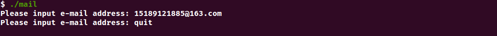

# Mail_VerifyCode

## 环境
Ubuntu 20.04  
g++ (Ubuntu 9.3.0-17ubuntu1~20.04) 9.3.0  
autoconf (GNU Autoconf) 2.69  

## 文件目录
code 所有代码的存放地  
build.sh 运行脚本  

## 运行
在当前目录下运行build.sh脚本<code>./build.sh</code>  
若是无法运行，请先运行<code>autoreconf -ivf</code>

## 运行截图

## 说明
主函数中仅有发送邮件的代码  
应用验证码限制，需自行调用方法
